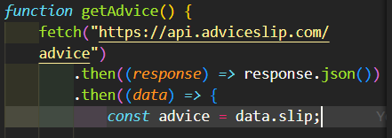

<h1 align="center">Frontend Mentor </h1>
<h2>Solução de aplicativo gerador de conselhos</h2>

<h1><a href="https://talithaneves.github.io/GeradorConselhos/">Veja o site</a> </h1>

## 📕 Sobre

Esta é uma solução para o desafio do **aplicativo Advice generator no Frontend Mentor** . Os desafios do Frontend Mentor ajudam você a melhorar suas
habilidades de codificação criando projetos realistas.

<h1>Índice</h1>

- [Visão geral](#sobre)
- [O desafio](#O-desafio)
- [Captura de tela](#Capturada-tela)
- [links](#links)
- [meu processo](#Meu-processo)
- [Construído com](#Construído-com) 
- [O que eu aprendi](#O-que-eu-aprendi)
- [Desenvolvimento contínuo](#Desenvolvimento-contínuo)
- [Autor](#Autor)
- [Agradecimentos](#Agradecimentos)

<h1>Visão geral</h1>
<h2> 🎯 O desafio</h2>

<h3>Os usuários devem ser capazes de:</h3>

✅ Layout ideal para o aplicativo dependendo do tamanho da tela do dispositivo;

✅ Ver os estados de foco para todos os elementos interativos na página;

✅ Gere um novo conselho clicando no ícone do dado;

✅ Copie o conselho para a área de transferência (este é um desafio extra, achei interessante adicionar).

<h1>Captura de tela</h1>

 

<h1>links</h1> 

URL da solução do Frontend Mentor: [Mentor Frontend](https://www.frontendmentor.io/solutions/advice-generator-app-using-html5-css3-js-flexbox-axios-SVdhLnAQxT)
URL da solução: [Github](https://github.com/TalithaNeves/GeradorConselhos)
<h1>🔨 Ferramentas</h1>
<h2> ♻ Construído com</h2>

- [HTML5](https://www.w3schools.com/tags/tag_doctype.asp)
- [CSS](https://developer.mozilla.org/pt-BR/docs/Web/CSS)
- [Flexbox](https://developer.mozilla.org/pt-BR/docs/Learn/CSS/CSS_layout/Flexbox)
- [Axios](https://axios-http.com/ptbr/docs/intro)
- [biblioteca JS baseada em promessas](https://axios-http.com/ptbr/)
- [Advice Slip JSON API](https://api.adviceslip.com/)
- [API de - aconselhamento](https://api.adviceslip.com/advice)

<h1> 🚀 O que eu aprendi</h1>
Aprendi a realizar uma requisição de API.

<h2> 👩‍💻 Desenvolvimento contínuo</h2>
Quero melhorar minhas habilidades sobre API e os próximos desafios serão em ReactJS.

<h1>Autor</h1>

- [Mentor Frontend](https://www.frontendmentor.io/solutions/advice-generator-app-using-html5-css3-js-flexbox-axios-SVdhLnAQxT)
- [Talitha Neves Lemes](https://www.linkedin.com/in/talitha-neves-lemes-025b66168/)

<h2>Agradecimentos</h2>

- Agradecimento a DevQuest, uma incrível comunidade Developers ;

- Agradecimentos ao MDN Web Docs MDN Web Docs .
